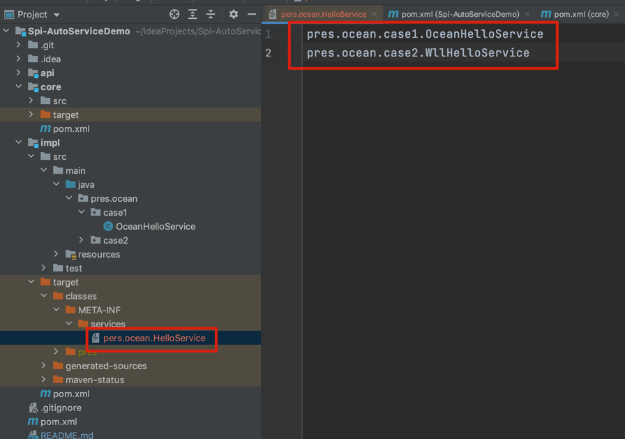

# Spi-AutoServiceDemo
spi demo 和 google的autoService demo  
此项目为了学习spi技术及使用autoService
# SPI
SPI全称Service Provider Interface，是Java提供的一套用来被第三方实现或者扩展的API，它可以用来启用框架扩展和替换组件。  
Java SPI 实际上是“基于接口的编程＋策略模式＋配置文件”组合实现的动态加载机制。

系统设计的各个抽象，往往有很多不同的实现方案，在面向的对象的设计里，一般推荐模块之间基于接口编程，模块之间不对实现类进行硬编码。

一旦代码里涉及具体的实现类，就违反了可拔插的原则，如果需要替换一种实现，就需要修改代码。为了实现在模块装配的时候能不在程序里动态指明，这就需要一种服务发现机制。


Java SPI就是提供这样的一个机制：为某个接口寻找服务实现的机制。有点类似IOC的思想，就是将装配的控制权移到程序之外，在模块化设计中这个机制尤其重要。所以SPI的核心思想就是解耦。


## 使用介绍

要使用Java SPI，需要遵循如下约定：  
1、当服务提供者提供了接口的一种具体实现后，在jar包的META-INF/services目录下创建一个以“接口全限定名”为命名的文件，内容为实现类的全限定名；  
2、接口实现类所在的jar包放在主程序的classpath中；  
3、主程序通过java.util.ServiceLoder动态装载实现模块，它通过扫描META-INF/services目录下的配置文件找到实现类的全限定名，把类加载到JVM；  
4、SPI的实现类必须携带一个不带参数的构造方法；

### 项目结构
```java
.
├── api // 接口模块
│   └── src
│       ├── main
│       └── test
├── core // 核心启动模块
│   └── src
│       ├── main
│       └── test
└── impl // 接口实现模块
    └── src
        ├── main
        └── test

```

## 说明
- api模块为接口模块定义了HelloService接口
- core模块模拟的是我们日常开发中完整的项目
- impl模块是接口模块的一个实现，可以有多个别的实现模块来替换它

## 实现步骤
1. 步骤一  
   定义一个接口例如我定义了一个pers.ocean.HelloService接口
```java
/**
 * @author ocean_wll
 * @date 2021/6/25
 */
public interface HelloService {

    /**
     * 说 hi 接口
     *
     * @return 返回值
     */
    String sayHi();
}
```   
   
2. 步骤二  
   写接口的多个实现，例如pres.ocean.case1.OceanHelloService和pres.ocean.case2.WllHelloService
```java
/**
 * @author ocean_wll
 * @date 2021/6/25
 */
public class OceanHelloService implements HelloService {

    @Override
    public String sayHi() {
        return "hello ocean!";
    }
}
```   

```java
/**
 * @author ocean_wll
 * @date 2021/6/25
 */
@AutoService(HelloService.class)
public class WllHelloService implements HelloService {

    @Override
    public String sayHi() {
        return "hello wll!";
    }
}
```
3. 步骤三(有两种不同的方式)  
    1）、 在 src/main/resources/ 下建立 /META-INF/services 目录， 新增一个以接口命名的文件 (pers.ocean.HelloService文件)，内容是要应用的实现类（这里是pres.
   ocean.case1.OceanHelloService）。   
    2）、引入autoService包,并在对应的实现类上加上@AutoService 如 pres.ocean.case2.WllHelloService，autoService会自动帮你创建1）中对应的文件
```java
<dependency>
    <groupId>com.google.auto.service</groupId>
    <artifactId>auto-service</artifactId>
    <version>1.0-rc2</version>
</dependency>
```

可以看到对应的/META-INF/services下有个pers.ocean.HelloService文件，里面有两行内容pres.ocean.case1.OceanHelloService和pres.ocean.case2.WllHelloService


4. 步骤四  
    通过ServiceLoader获取对应的实现
```java
    ServiceLoader<HelloService> serviceLoader = ServiceLoader.load(HelloService.class);
    for (HelloService helloService : serviceLoader) {
        System.out.println(helloService.getClass().getName() + " say: " + helloService.sayHi());
    }
```   

